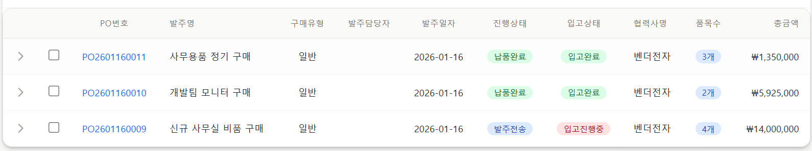

발주진행현황(`/order/progress`) 페이지에서 각 발주(PO) 건에 대한 실제 입고 진행 상황을 직관적으로 파악하기 위해 '입고상태' 컬럼을 추가하고 시각적 배지(Badge)를 적용

## **변경 사항 (Changes)**

### **(1) Backend**

- **DTO 수정 (PurchaseOrderDTO.java)**: 목록 조회 시 입고 수량을 담을 `receivedQuantity` 필드 추가.
- **Mapper 수정 (PurchaseOrderMapper.xml)**:
    - **selectList** 쿼리에 서브쿼리를 추가하여 해당 PO번호와 연결된 **정상 입고(취소 제외) 수량의 합계**를 계산.
    
    ```sql
    (SELECT COALESCE(SUM(d.GR_QT), 0) 
     FROM GRDT d 
     JOIN GRHD g ON d.GR_NUM = g.GR_NUM 
     WHERE g.PO_NUM = h.PO_NUM 
       AND g.DEL_FLAG = 'N' 
       AND g.PROGRESS_CD != 'GRX' 
       AND d.DEL_FLAG = 'N' 
       AND d.STATUS_CD = 'N') AS receivedQuantity
    ```
    

### **(2) Frontend**

- **인터페이스 수정 (src/types/purchaseOrder.ts)**: **PurchaseOrderDTO**에 `receivedQuantity` 필드 추가.
- **UI 수정 (order/progress/page.tsx)**:
    - 테이블 헤더에 '입고상태' 컬럼 추가.
    - 각 행(Row)에 입고 상태에 따른 배지 표시 로직 구현.

## **입고 상태 표시 규칙**

| **상태 명** | **조건 (Condition)** | **배지 색상 (Color)** | **설명** |
| --- | --- | --- | --- |
| **미입고** | `입고수량 == 0` | Unknown (Gray) | 입고된 내역이 전혀 없음 |
| **입고진행중** | `입고수량 > 0` AND (PO 상태 != '완료') | Red | 일부 입고되었으나 잔량이 남음 (부분입고) |
| **입고완료** | PO 상태 == 'C' (납품완료) | Green | 모든 품목이 입고되어 종결 가능한 상태 |




- 구매 담당자가 상세 페이지나 입고 현황 페이지로 이동하지 않고도 발주 목록에서 즉시 부분 입고 여부를 확인할 수 있음.
- 장기 미입고 건이나 지연 건 식별이 용이해짐.