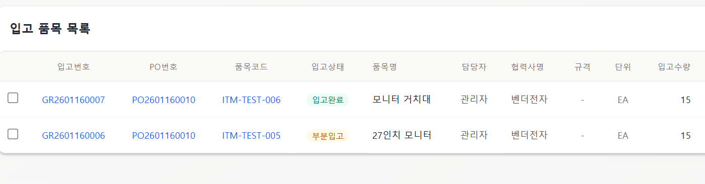

## **1. 문제 상황 (Issue)**

하나의 발주(PO)에 대해 여러 번에 걸쳐 나누어 입고를 진행하는 '부분 입고' 시나리오에서 상태 값 불일치가 발생함.

- **현상**:
    1. 첫 번째 입고 시: 상태가 **'부분 입고'**로 정상 기록됨.
    2. 마지막 잔여 수량 입고 시: 해당 입고 건은 **'입고 완료'**가 되지만, 이전에 생성된 '부분 입고' 건들은 여전히 **'부분 입고'** 상태로 남아있음.
- **결과**: 동일한 PO에 대한 입고 건들이 서로 다른 상태(부분 입고 / 입고 완료)를 가지게 되어 데이터 정합성이 깨지고 사용자에게 혼란을 줌.



## **2. 원인 (Cause)**

- 기존 로직(**updateHeaderStatusByPO**)은 입고 처리가 발생했을 때, **현재 처리 중인 특정 입고 번호(GR No)**의 상태만 업데이트하도록 작성됨.
- PO의 전체 입고 수량이 충족되어 상태가 변하더라도, 과거에 생성된 다른 입고 건들의 상태를 갱신해주는 로직이 부재함.

## **3. 해결 방안 (Solution)**

- 입고 처리(등록/수정/취소) 시마다 해당 PO의 발주 잔량을 다시 계산하여 전체 상태(미입고/부분입고/입고완료)를 결정.
- 결정된 새로운 상태 값을 **해당 PO와 연결된 모든 유효한(취소되지 않은) 입고 내역**에 일괄 적용하도록 변경.

## **4. 구현 코드 (Implementation)**

### **(1) Backend Mapper (SQL)**

특정 PO 번호를 가진 모든 입고 헤더(GRHD)의 상태를 일괄 업데이트하는 쿼리 추가.

```xml
<!-- GoodsReceiptMapper.xml -->
<update id="updateAllHeadersStatusByPO"> 
    UPDATE GRHD 
    SET PROGRESS_CD = #{status}, 
        MOD_DATE = NOW(), 
        MOD_USER_ID = #{modUserId} 
    WHERE PO_NUM = #{poNo} 
      AND PROGRESS_CD != 'GRX'  <!-- 입고 취소된 건은 제외 -->
      AND DEL_FLAG = 'N' 
</update>
```

### **(2) Backend Service (Java)**

상태 계산 후, 단건 업데이트(updateHeaderStatus) 대신 다건 

`일괄 업데이트`(**updateAllHeadersStatusByPO**) 메서드 호출.

```java
// GoodsReceiptService.java
private void updateHeaderStatusByPO(String poNo, String grNo, String userId) {
    // ... (누적 입고 수량 및 발주 수량 조회 로직) ...
    // 상태 결정 (부분입고 vs 입고완료)
    String newStatus;
    if (accumulatedQty.compareTo(BigDecimal.ZERO) == 0) {
        newStatus = GoodsReceiptStatus.NOT_RECEIVED;
    } else if (accumulatedQty.compareTo(orderQty) >= 0) {
        newStatus = GoodsReceiptStatus.COMPLETED;
    } else {
        newStatus = GoodsReceiptStatus.PARTIAL;
    }
    // [변경] 특정 PO에 연결된 모든 입고 헤더 상태를 일괄 업데이트
    // 기존: goodsReceiptMapper.updateHeaderStatus(grNo, newStatus, userId);
    goodsReceiptMapper.updateAllHeadersStatusByPO(poNo, newStatus, userId);
    
    // ... (PO 상태 동기화 로직) ...
}
```

## **5. 결과 (Outcome)**

- **Before**:
    - GR1 (부분입고)
    - GR2 (입고완료 - 마지막 입고)
- **After**:
    - GR1 (**입고완료** - 자동 업데이트됨)
    - GR2 (입고완료)
- 최종적으로 모든 품목이 입고되면, 과거의 내역들도 모두 '입고 완료' 상태로 통일